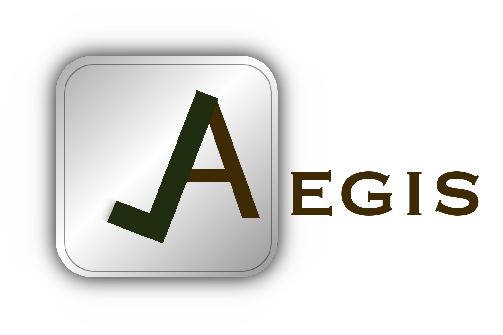

# Aegis Project README



## Overview
Aegis is a project management system designed to simplify task management for small teams and individual users. It focuses on core features like task creation, assignment, and progress tracking without unnecessary complexity.

## Project Structure
- **Backend**: Contains the server-side code for the project.
- **Client**: Contains the client-side code for the project, built with Vue.js.
- **README.md**: This file, providing an overview of the project and instructions for setup.

## Compilation Steps for Docker Container (Client)

### Prerequisites
- Docker installed on your system.
- `docker-compose` installed on your system
- Vue.js installed globally (optional but recommended for development).


### Step 1: Build the Docker Image
Open a terminal in the `./client` directory and run the following command to build the Docker image:

```
docker-compose build
```


### Step 2: Run the Docker Container
Once the image is built, you can run a container from it using the following command:

```
docker-compose up
```


### Step 3: Verify the Application
After running the container, you can verify that your frontend application is running by accessing [https://localhost:8080](https://localhost:8080) in your web browser. You should see your Vue.js application up and running.

> Get an error stating that the certificate is invalid? Go to `advanced` and click `accept anyways`

## Compilation steps for server

### Step 1: Build the docker image
Open a terminal in the `./server` directory and run the following command to build the Docker image:

```
docker-compose -build
```

###  Step 2: Run the docker image

```
docker-compose up
```

### Step 3: ???

### Step 4: Profit

## License
This project is licensed under the GPL-3.0 License. See the [LICENSE](LICENSE) file for details.